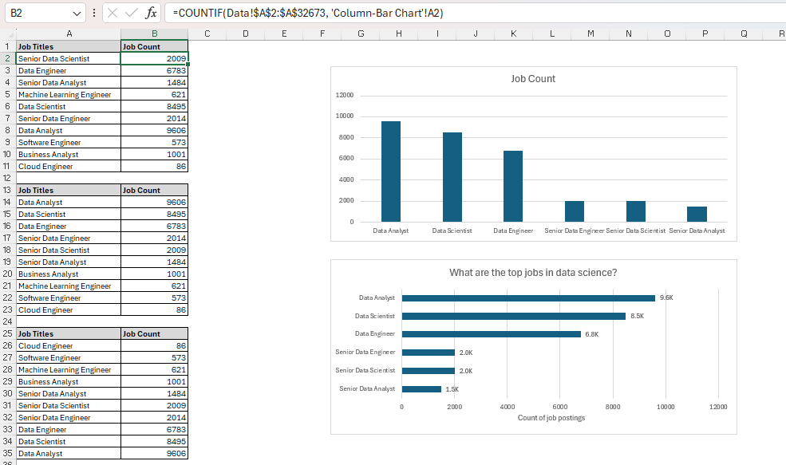

# 📊 Data Jobs Market Analysis

An end-to-end data analysis project exploring **32,672 job postings** across the data industry — built with **Power BI** for interactive dashboards and **Microsoft Excel** for chart-based analysis.

---

## 📁 Project Files

| File | Tool | Description |
|------|------|-------------|
| `JobsDashboard.pbix` | Power BI | Interactive dashboard with filters & visuals |
| `Tochy_s_Portfolio.xlsx` | Excel | Chart analysis — line, pie, and bar charts |

---

## 🖥️ Power BI Dashboard

An interactive Power BI dashboard for exploring the data jobs market.

### 📥 Download
> [**Download JobsDashboard.pbix**](https://github.com/tochi-nwankwo/data-jobs-dashboard/blob/main/JobsDashboard.pbix)  
> *(Requires Power BI Desktop — free download from Microsoft)*

### 📸 Preview

---

## 📗 Excel Analysis — `Tochy_s_Portfolio.xlsx`

### 📥 Download
> [**Download Tochy_s_Portfolio.xlsx**](https://github.com/tochi-nwankwo/data-jobs-dashboard/blob/main/Tochy_s_Portfolio.xlsx)  
> *(Requires Microsoft Excel or Google Sheets)*

A structured Excel workbook with 4 sheets analyzing job posting trends, salary data, and role distribution.

### 📸 Preview

### Sheets Overview

#### 1. 🗃️ Data
Raw dataset of **32,672 job postings** with 16 fields including:
- Job title, location, country, and posting date
- Salary (annual & hourly averages)
- Required skills, schedule type, and remote work flag
- Health insurance and degree requirement flags

#### 2. 📈 Line Chart — Job Postings by Month
Tracks how job posting volume changed across each month of the year, revealing hiring trends and seasonal patterns in the data industry.

#### 3. 🥧 Pie Chart — Degree Requirements
Breaks down the share of roles that mention a degree requirement vs. those that don't — useful for understanding accessibility in data careers.

#### 4. 📊 Column/Bar Chart — Jobs by Title
Compares posting counts across the top data job titles:

| Job Title | Postings |
|-----------|----------|
| Data Analyst | 9,606 |
| Data Scientist | 8,495 |
| Data Engineer | 6,783 |
| Senior Data Engineer | 2,014 |
| Senior Data Scientist | 2,009 |
| Senior Data Analyst | 1,484 |
| Business Analyst | 1,001 |
| Machine Learning Engineer | 621 |

---

## 📌 Dataset Highlights

- **Total Job Postings:** 32,672
- **Top Country:** United States (25,141 postings)
- **Salary Range (Annual):** $15,000 – $960,000
- **Most In-Demand Role:** Data Analyst
- **Common Skills:** SQL, Python, Tableau, Power BI, AWS

---

## 🛠️ Tools Used

---

## 👤 Author

**Tochi Nwankwo**  
[GitHub](https://github.com/tochi-nwankwo)
