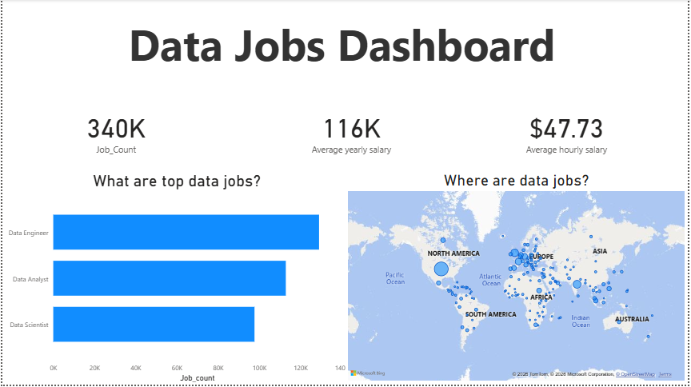

# Data Jobs Dashboard

## Overview
An interactive Power BI dashboard analysing the global data job market, 
focusing on Data Analyst, Data Engineer, and Data Scientist roles.

## Key Insights
- 📊 340,000 data jobs analysed globally
- 💰 Average yearly salary of $116K
- ⏱️ Average hourly salary of $47.73
- 🌍 Geographic distribution of data jobs worldwide
- 🏆 Data Engineer is the most in-demand role globally

## What the Dashboard Shows
- Top data jobs by volume
- Global map showing where data jobs are located
- Salary metrics across roles
- Comparison between Data Analyst, Data Engineer and Data Scientist roles

## Tools Used
- Power BI Desktop
- Data visualisation
- Data cleaning and transformation

## Download
Download the Power BI file to interact with the dashboard:
[📥 Click here to download](JobsDashboard.pbix) 

## Dashboard Preview
 
